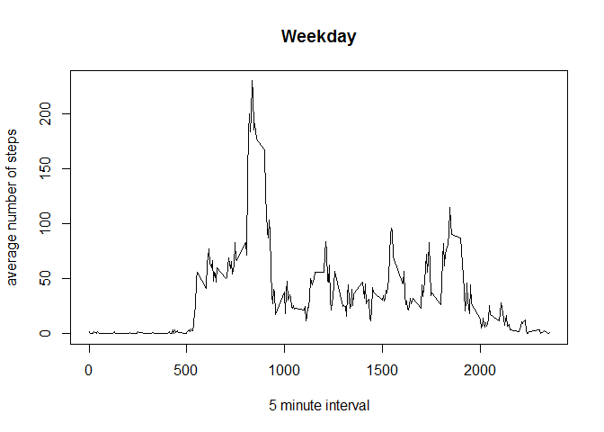

# Reproducible Research: Peer Assessment 1
##Loading and preprocessing the data
_________________________________________________________  

####1.Load the data

```r
data <- read.csv("activity.csv")
```

##What is mean total number of steps taken per day?
_________________________________________________________  

####1.Calculate the total number of steps taken per day   


```r
total_steps_per_day <- aggregate(steps~date,data=data,sum)
```

####2.Make a histogram of the total number of steps taken each day 
#####Margin and panel settings

```r
par(mar=c(4.1,4.1,2.1,1.1))
par(mfrow=c(1,1))
```
#####Plot the histogram

```r
hist(total_steps_per_day$steps, col = "red", main = "Total number of steps per day", xlab = "Steps")
```

 

####3.Calculate and report the mean and median of the total number of steps taken per day   


```r
mean_steps <- mean(total_steps_per_day$steps)
median_steps <- median(total_steps_per_day$steps)
```
  
  
#####The mean of the total number of steps taken per day 10766  
#####The median of the total number of steps taken per day 10765  


##What is the average daily activity pattern?  
_________________________________________________________  

####1.Make a time series plot (i.e. type = "l") of the 5-minute interval (x-axis) and the average number of steps taken, averaged across all days (y-axis)  


```r
daily_activity_pattern <- aggregate(steps~interval,data=data,mean)
plot(x=daily_activity_pattern$interval,y=daily_activity_pattern$steps,type="l", xlab="Interval", ylab="Average number of steps", main="Average number of steps taken across all days per interval")
```

 

####2.Which 5-minute interval, on average across all the days in the dataset, contains the maximum number of steps?

```r
max_index <- which.max(daily_activity_pattern$steps)
interval_with_max_steps <- daily_activity_pattern[max_index,1]
```

##### The 5-minute interval, on average across all the days in the dataset, containing the maximum number of steps is 835

##Imputing missing values 
_________________________________________________________  

####1.Calculate and report the total number of missing values in the dataset (i.e. the total number of rows with NAs)  


```r
missing_number <- sum(is.na(data))
```

#####The total number of missing values in the dataset is 2304  

####2.Devise a strategy for filling in all of the missing values in the dataset.  
##### Using the the mean for that 5-minute interval to impute the misisng data.  
####3.Create a new dataset that is equal to the original dataset but with the missing data filled in.  

#####Split data by interval

```r
split_data <- split( data , data$interval )
```

#####Replace each NA by the mean for that interval

```r
for(i in 1:length(split_data))
{
split_data[[i]] <- transform(split_data[[i]], steps = ifelse(is.na(steps), mean(steps, na.rm=TRUE), steps))
}
```

#####Binding the split data back together

```r
new_data <- do.call("rbind", split_data)
```


#### 4. Make a histogram of the total number of steps taken each day and Calculate and report the mean and median total number of steps taken per day. Do these values differ from the estimates from the first part of the assignment? What is the impact of imputing missing data on the estimates of the total daily number of steps?    

#####Calculate the total number of steps taken per day with the new imputed data

```r
new_total_steps_per_day <- aggregate(steps~date,data=new_data,sum)
```
#####Plot the histogram

```r
hist(new_total_steps_per_day$steps, col ="red", main = "Total number of steps per day with imputed data", xlab = "Steps")
```

 

#####Calculate and report the mean and median of the total number of steps taken per day   


```r
new_mean_steps <- mean(new_total_steps_per_day$steps)
new_median_steps <- median(new_total_steps_per_day$steps)
```
  
  
#####The mean of the total number of steps taken per day 10766  
#####The median of the total number of steps taken per day 10766 
#####Imputing misisng data has not impacted the mean while the median increased by 1.

##Are there differences in activity patterns between weekdays and weekends?
_________________________________________________________  

####1.Create a new factor variable in the dataset with two levels - "weekday" and "weekend" indicating whether a given date is a weekday or weekend day.  

#####Add a "isWeekend"" boolean column to indicate if it's weekday or weekend. The assumption is that the weekend comprises of Saturday and Sunday

```r
new_data$isWeekend <- weekdays(as.Date(as.character(new_data$date),"%Y-%m-%d")) %in% c('Sunday','Saturday')
```
#####Use the "isWeekend" column to create the factor variable "weekend_weekday"

```r
new_data <- transform(new_data ,weekend_weekday = ifelse(isWeekend ,"weekend","weekday" ))
```

####2.Make a panel plot containing a time series plot (i.e. type = "l") of the 5-minute interval (x-axis) and the average number of steps taken, averaged across all weekday days or weekend days (y-axis).  

#####Split weekend and weekday data

```r
split_data_weekday_weekend <- split( new_data  , new_data$weekend_weekday )
weekday_data <- split_data_weekday_weekend[[1]]
weekend_data <- split_data_weekday_weekend[[2]]
```
#####Calculate average number of steps taken per interval for the weekday and weekend data

```r
weekday_activity_pattern <- aggregate(steps~interval,data=weekday_data,mean)
weekend_activity_pattern <- aggregate(steps~interval,data=weekend_data,mean)
```
#####Margin and panel settings

```r
par(mfrow=c(2,1))
par(mar=c(4.1,4.1,2.1,1.1))
```
#####Make the two panel plot

```r
plot(x=weekend_activity_pattern$interval,y=weekend_activity_pattern$steps,type="l", main="Weekend", xlab="5 minute interval",ylab ="average number of steps")
plot(x=weekday_activity_pattern$interval,y=weekday_activity_pattern$steps,type="l", main="Weekday", xlab="5 minute interval",ylab ="average number of steps" )
```
  


#####The plots indicate that there is a significant difference in the activity pattern over the weekend versus the weekdays.
#####* The activity seems to pick up at a later time interval on the weekend. 
######* The average activity throughout the day is higher on the weekend as compared to that on the weekdays
#####The similarity being that the activity seems to peak at around the same time interval on weekdays and weekends.
